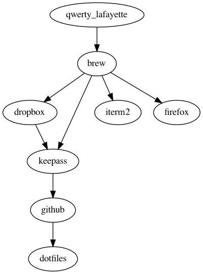

# My beloved config

## Requirements
- Be compatible on macOS and Linux
- Make work in a terminal as efficient as possible
  
## Software choices

- shell : [zsh](https://wiki.archlinux.org/index.php/zsh) with [prezto](https://github.com/sorin-ionescu/prezto) and [powelevel10k](https://github.com/romkatv/powerlevel10k) prompt

### why zsh over bash

- Automatic cd: `/usr` has the same effect as `cd /usr`
- Spelling correction: `cd /uzr<Tab>` is fixed to `cd /usr`
- Path expansion `cd /u/lo/b<Tab>` expands to `cd /usr/local/bin`
- Smarter completion for commands like `git`, `ssh`
- Recursive globbing `vim **/*.md` opens all markdown files in the current dir and descendants
- Fish-like features: [zsh-autosuggestions](https://github.com/zsh-users/zsh-autosuggestions), [zsh-syntax-highlighting](https://github.com/zsh-users/zsh-syntax-highlighting), [zsh-history-substring-search](https://github.com/zsh-users/zsh-history-substring-search)

### prezto modules

- archive: add handy functions `archive`, `unarchive`
- directory: add `d` and `1..9` to navigate through pushed directories. Also configures `AUTO_CD`, `CDABLE_VARS`
- editor: add `bindkey-all` to display bind keys
- fasd: quick navigation through frecent files and directories. add `j` and `,<Tab>`
- history: add `history-stat`

## How to install
### Linux
```
curl https://raw.githubusercontent.com/YannMoisan/dotfiles/master/scripts/setup | bash -s linux
```

#### Software
- window manager : [i3](https://wiki.archlinux.org/index.php/i3)
- terminal : [urxvt](https://wiki.archlinux.org/index.php/Rxvt-unicode)

#### Keyboard shortcuts
##### i3
|shortcut|description|
|---|---|
|Super+Enter|open a terminal|
|Super+[hjkl]|focus window|
|Super+Shift+[hjkl]|move focus window|
|Super+[asdf]|switch between mode|
|Super+[ui]|prev/next workspace|
|Super+[r]|reload|
|Super+Shift+Backspace|restart|
|Super+Ctrl+Backspace|exit|
|Super+o|split v|
|Super+Shift+o|split h|

##### urxvt

|shortcut|description|
|---|---|
|Ctrl+Alt+C|Copy to clipboard|
|Ctrl+Alt+V|Paste from clipboard|
|Ctrl+[↓↑]|increase/decrease font size|
|Ctrl+=|back to default size|
|Ctrl+/|display current font in a pop-up|
|Ctrl+Delete|open last url in a browser|
|Alt+Delete|list url in a pop-up|

##### tmux
|shortcut|description|
|---|---|
|ctrl+b ?|help|
|ctrl+b [pn]|prev/next window|

#### Useful command for configuring X/i3
- `xset` : user preference utility for X (bip, DPMS)
- `xset q` : display current settings
- `xprop` : property displayer for X (get window class for i3 config)
- `xev` : print contents of X events (get keycodes for i3 config)
- `xinput` : utility to configure and test X input devices (touchpad, …)
- `xinput list` : list all the input devices
- `fc-list` : list available fonts


### Mac
Prerequisites

- install brew and iterm2
- brew install git
- configure ssh keys in github

```
curl https://raw.githubusercontent.com/YannMoisan/dotfiles/master/scripts/setup | bash -s clone
curl https://raw.githubusercontent.com/YannMoisan/dotfiles/master/scripts/setup | bash -s git
curl https://raw.githubusercontent.com/YannMoisan/dotfiles/master/scripts/setup | bash -s zsh
```

Open a new tab in your terminal and p10k configuration will be launched automatically and will install Meslo fonts

## Installation order



generated from the CLI with `dot -Tpng installation-order.dot -o installation-order.png`

## Update the system

- prezto
	- git fetch upstream
	- git merge upstream/master
	- git submodule update --init --recursive
- brew
	- brew update
	- brew upgrade
- vim plugins
	- gws ff
	
## CLI tools

- [bat](https://github.com/sharkdp/bat): Clone of cat(1) with syntax highlighting and Git integration
- [ctop](https://bcicen.github.io/ctop/): Top-like interface for container metrics
- [diff-so-fancy](https://github.com/so-fancy/diff-so-fancy): Good-looking diffs with diff-highlight and more)
- [exa](https://the.exa.website): Modern replacement for 'ls' (so we don't need `.dircolors` anymore and `tree`)
- [fd](https://github.com/sharkdp/fd): Simple, fast and user-friendly alternative to find
- [fzf](https://github.com/junegunn/fzf): Command-line fuzzy finder written in Go
- [gh](https://cli.github.com/manual/): GitHub command-line tool. Replacement of hub
- git (install the brew version on Mac)
- [glances](https://github.com/nicolargo/glances): Alternative to top/htop
- [gws](https://streakycobra.github.io/gws/): Manage workspaces composed of git repositories. Use to manage my VIM plugins.
- [htop](https://htop.dev/): Improved top (interactive process viewer)
- [httpie](https://httpie.io/): User-friendly cURL replacement (command-line HTTP client)
- [iftop](https://www.ex-parrot.com/~pdw/iftop/): Display an interface's bandwidth usage
- [jq](https://stedolan.github.io/jq/): Lightweight and flexible command-line JSON processor
- [ncdu](https://dev.yorhel.nl/ncdu): NCurses Disk Usage
- [ranger](https://ranger.github.io): File browser
- [rename](http://plasmasturm.org/code/rename): Perl-powered file rename script with many helpful built-ins
- [ripgrep](https://github.com/BurntSushi/ripgrep): Search tool like grep and The Silver Searcher
- [shellcheck](https://www.shellcheck.net/): Static analysis and lint tool, for (ba)sh scripts
- [tig](https://jonas.github.io/tig/): Text interface for Git repositories
- [tldr](https://tldr.sh/): Simplified and community-driven man pages
- vim (install the brew version on Mac)
- [youtube-dl](https://youtube-dl.org/): Download YouTube videos from the command-line

### Dev

- ammonite-repl
- coursier
- openjdk
- sbt
- scala

## Troubleshooting
A script `scripts/check` displays useful pieces of information to help you spot the issue.

## Thanks to
- [Kaze's dotfiles](https://github.com/fabi1cazenave/dotFiles/) - My dotfiles are based on this awesome work !
- [dotfiles.github.io](https://dotfiles.github.io/) - good to read if you want to store your dotfiles on github
